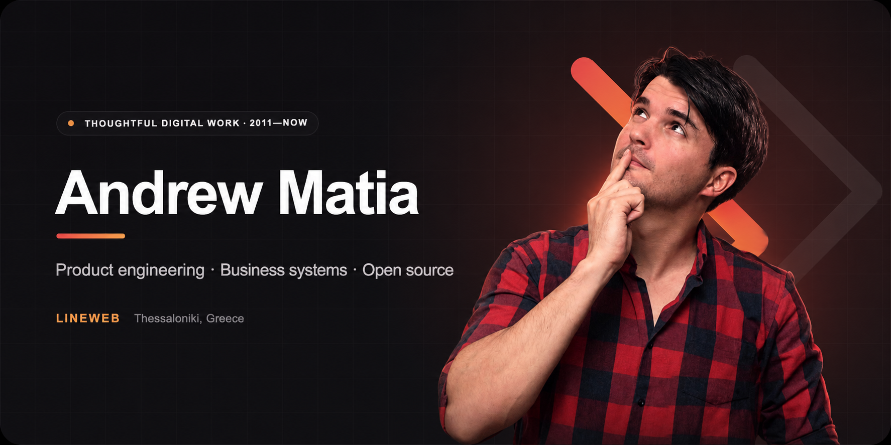
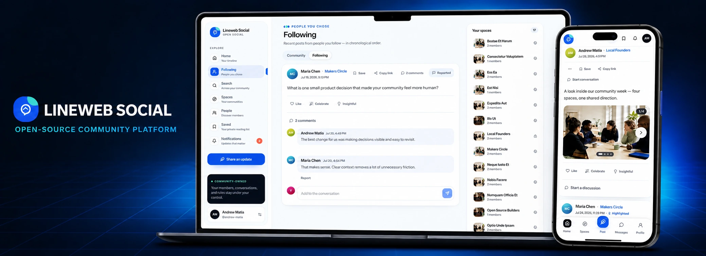

  

  I build digital products that have to survive real business use, from focused websites 
  and commerce platforms to custom software, automation and open-source tools.

  
  
  

8 public products · Open-source contributions across WordPress, WooCommerce, Laravel and the wider web ecosystem

## Work that holds up outside the pitch

I am Andrew Matia, a product-minded developer based in Thessaloniki, Greece. Since 2011, I have worked across engineering, UX, performance, security, SEO and growth. Useful software is never only about the code.

At [Lineweb](https://lineweb.gr), I turn operational problems into clear digital systems. That can mean a Laravel product, a React interface, a WooCommerce workflow, a WordPress plugin, an automation layer or careful recovery work on an exposed production system.

The practical rule is simple: **understand the weight first, then build with enough clarity for the work to survive real use.**

## Open-source products

### [Lineweb Social](https://github.com/drewmt/lineweb-social)

A Laravel-native, self-hosted foundation for modern communities and social products. It provides feeds, profiles, Spaces, private messaging, moderation, privacy controls, APIs and an extension lifecycle that other teams can build on.

`Laravel` · `Inertia` · `React` · `TypeScript` · `Self-hosted` · `GPL-3.0-or-later`

**Current release:** [`0.2.0-beta.1`](https://github.com/drewmt/lineweb-social/releases/tag/v0.2.0-beta.1) for evaluation and controlled community pilots. [Explore the live beta](https://social.lineweb.gr/).

  

### WordPress & WooCommerce tools by Lineweb

<table>
  <tr>
    <td width="50%" valign="top">
      
      <h3><a href="https://github.com/drewmt/lineweb-blocks">Lineweb Blocks Suite</a></h3>
      
Six native Gutenberg blocks for pricing, ROI, comparisons, evidence, cost estimates and readiness, without turning WordPress into another page-builder workflow.

      WordPress · Gutenberg · PHP · JavaScript
    </td>
    <td width="50%" valign="top">
      
      <h3><a href="https://github.com/drewmt/lineweb-commerce">Lineweb Commerce Suite</a></h3>
      
Four WooCommerce tools for product specifications, delivery estimates, free-shipping progress and factual product comparison using live store data.

      WooCommerce · Gutenberg · Store API · PHP
    </td>
  </tr>
</table>

### Focused WordPress plugins

| Project | What it solves |
| --- | --- |
| **[Lineweb Checkout GR](https://github.com/drewmt/lineweb-checkout-gr)** | Greek receipt and invoice fields across classic and block checkout, including local VAT checksum validation, HPOS support and privacy tools. |
| **[Lineweb Store Guard](https://github.com/drewmt/lineweb-store-guard)** | Read-only WooCommerce preflight snapshots and before/after update diagnostics, with an admin dashboard and WP-CLI output. |
| **[Lineweb Content Review](https://github.com/drewmt/lineweb-content-review)** | Human owners, review dates and an overdue queue for posts, pages and WooCommerce products. |
| **[Lineweb Restaurant Orders](https://github.com/drewmt/lineweb-restaurant-orders)** | A self-hosted restaurant menu and ordering plugin with no commissions or paid feature gates. |
| **[Withdrawal for WooCommerce](https://github.com/drewmt/lineweb-withdrawal-for-woocommerce)** | A focused workflow for electronic contract-withdrawal statements and timestamped receipts. |

The projects are independently installable, documented and useful without a Lineweb account. Each repository explains its own data, privacy and operational boundaries; internal notes and client material stay private.

## Open-source contributions

I contribute focused fixes, tests, compatibility work and maintainability improvements to established open-source projects. Recent work spans the [WordPress](https://github.com/WordPress/gutenberg) and [WooCommerce](https://github.com/woocommerce/woocommerce) ecosystems, [GatherPress](https://github.com/GatherPress/gatherpress), the wider [Laravel](https://github.com/laravel/framework) and [PHP](https://github.com/pestphp/pest) community, [Inertia](https://github.com/inertiajs/inertia-laravel), [Matomo](https://github.com/matomo-org/matomo), [Coolify](https://github.com/coollabsio/coolify), [Flarum](https://github.com/flarum/framework), [Ant Design](https://github.com/ant-design/ant-design) and [Buzz](https://github.com/block/buzz).

## What I work with

  
  
  
  
  
  
  
  
  

- Product engineering and custom business systems
- Laravel/PHP and Node.js backends with React/TypeScript interfaces
- WordPress plugins, WooCommerce workflows and B2B integrations
- Practical automation and operational tooling
- Performance, accessibility, security and technical SEO
- Production support where reliability and accountability matter

## How I approach the work

1. **Understand** the business, the pressure points and what success should actually mean.
2. **Shape** scattered requirements into a focused, honest technical direction.
3. **Build** for clarity, maintainability, accessibility and real-world use.
4. **Protect** the product with secure defaults, validation, tests and measured releases.
5. **Improve** from evidence after real people begin using it.

---

  <strong>Have something important to build or improve?</strong> 
  Start with a clear conversation at <a href="https://lineweb.gr/contact">lineweb.gr</a>.

